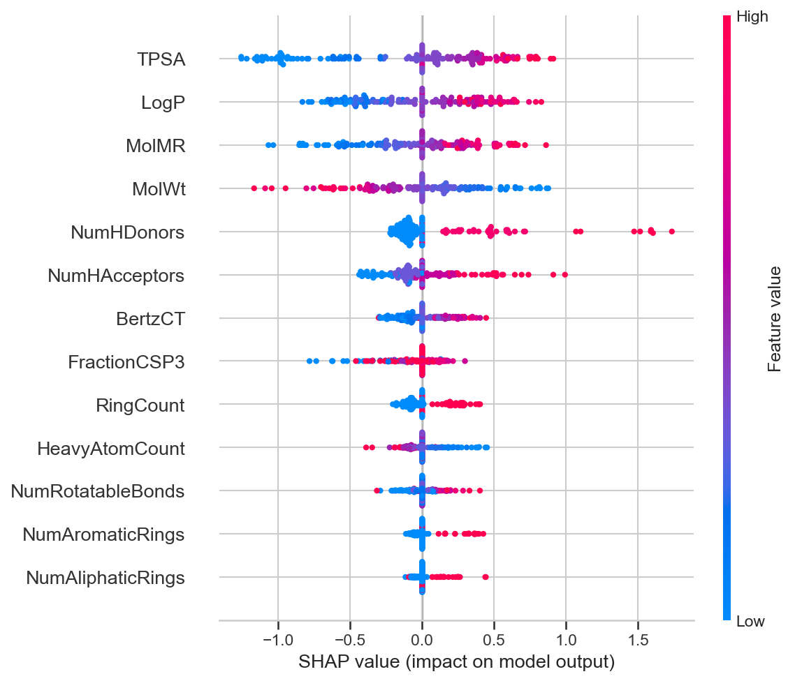
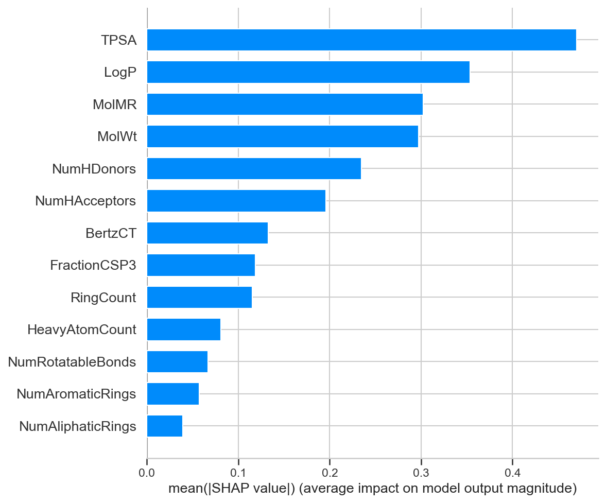
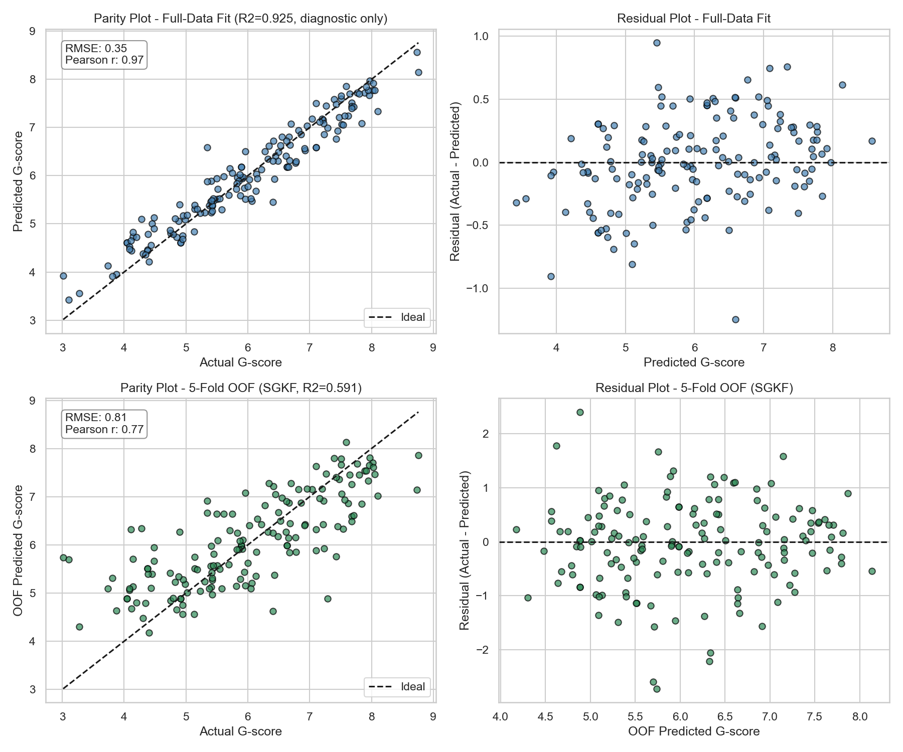

# Solvent Greenness (G-score) Model — Gaussian Process Regression

## Overview

This model predicts a solvent's **G-score** (a continuous "greenness" rating) from 13 molecular descriptors computed with RDKit from the solvent's SMILES string. It is a **Gaussian Process Regressor (GPR)** with a Matern(ν=1.5) + White-noise kernel, trained on a 154-solvent dataset.

This model **replaces the previous XGBoost final model** as the primary deployment model. It was selected after a nested cross-validation comparison showed it generalizes better and more *consistently* to unseen solvents — directly addressing the overfitting observed in the XGBoost version.

| | XGBoost (previous final model) | **GPR (this model)** |
|---|---|---|
| Nested-CV R² (mean, 95% CI) | 0.505 [0.334, 0.676] | **0.580 [0.507, 0.653]** |
| Nested-CV RMSE | 0.872 | **0.811** |
| Nested-CV MAE | 0.670 | **0.618** |

The GPR model is both more accurate on average **and** far more consistent across folds (CI width 0.15 vs. 0.34) — it never dropped below R²=0.51 on any held-out fold, whereas XGBoost dropped as low as R²=0.28.

## Why a Gaussian Process?

GPR is well suited to small datasets (n=154 here) because:
- It naturally regularizes via its kernel rather than requiring extensive hyperparameter tuning.
- It produces a **predictive uncertainty (standard deviation)** for every prediction, not just a point estimate — useful for flagging solvents the model is less confident about (e.g., those structurally dissimilar to the training set).
- Every outer fold of the nested CV independently selected the same kernel family (Matern, ν=1.5), indicating the choice is robust rather than an artifact of a single split.

## Model Specification

- **Pipeline:** `StandardScaler -> GaussianProcessRegressor`
- **Kernel:** `ConstantKernel * Matern(nu=1.5) + WhiteKernel` (amplitude, length scale, and noise level optimized during fitting)
- **Fitted kernel (full dataset):** `1.51**2 * Matern(length_scale=3.54, nu=1.5) + WhiteKernel(noise_level=0.153)`
- **Target:** `G-score` (continuous greenness score)
- **Training data:** 154 solvents, `data/RDKit_Features.csv` + `data/GSK_dataset.csv`
- **Validation protocol:** Outer 5-fold `StratifiedGroupKFold` (grouped by solvent SMILES, stratified by solvent classification), inner 4-fold `StratifiedGroupKFold` for kernel/hyperparameter selection

## Input Features (13 RDKit Descriptors)

| Descriptor | Definition |
|---|---|
| **MolWt** | Molecular weight (g/mol) |
| **LogP** | Calculated octanol-water partition coefficient — a measure of lipophilicity / hydrophobicity |
| **TPSA** | Topological Polar Surface Area (Ų) — sum of surface contributions from polar atoms |
| **NumHDonors** | Number of hydrogen bond donor groups (e.g., -OH, -NH) |
| **NumHAcceptors** | Number of hydrogen bond acceptor atoms (e.g., O, N) |
| **NumRotatableBonds** | Number of bonds that allow free rotation — a measure of molecular flexibility |
| **RingCount** | Total number of rings (aromatic + aliphatic) |
| **NumAromaticRings** | Number of aromatic rings |
| **FractionCSP3** | Fraction of carbon atoms that are sp³-hybridized — a measure of "saturation"/3D character |
| **MolMR** | Molar refractivity — related to molecular volume and polarizability |
| **HeavyAtomCount** | Number of non-hydrogen atoms |
| **NumAliphaticRings** | Number of non-aromatic (aliphatic) rings |
| **BertzCT** | Bertz topological complexity index — a measure of overall structural complexity |

## Feature Importance (SHAP)

The five most influential descriptors for the GPR model's predictions are:

1. **TPSA** — by far the dominant driver; low TPSA pushes G-score down, high TPSA pushes it up.
2. **LogP** — higher lipophilicity tends to push predictions up.
3. **MolMR**
4. **MolWt** — higher molecular weight tends to push predictions down.
5. **NumHDonors**

This is broadly consistent with the previous XGBoost model, where TPSA was also the top feature — reinforcing that polarity-related descriptors are the primary chemical drivers of the G-score.

*Each point is one solvent. Position along the x-axis shows how much that descriptor pushed the prediction up (right) or down (left) for that solvent; color shows whether the descriptor's value was high (red) or low (blue).*

*Overall ranking of descriptor importance, averaged across all 154 solvents.*

## Model Performance

- **Top row:** full-dataset fit (diagnostic only — the model has seen these points during training).
- **Bottom row:** out-of-fold (OOF) predictions from 5-fold cross-validation, i.e. each prediction is made by a model that never saw that solvent during training. This is the more realistic picture of real-world performance (RMSE=0.81, R²=0.59, Pearson r=0.77).

The headline generalization estimate, however, is the **nested cross-validation** result (R² = 0.580, 95% CI [0.507, 0.653]), since it accounts for hyperparameter/kernel selection bias as well.

## Capabilities

- **Point predictions** of G-score for new solvents from their RDKit descriptors.
- **Predictive uncertainty**: `model.predict(X, return_std=True)` returns a standard deviation alongside each prediction, allowing low-confidence predictions (e.g., solvents far from the training distribution) to be flagged.
- **Interpretability** via SHAP values, showing which descriptors drove each individual prediction.

## Limitations

- Trained on n=154 solvents grouped into a relatively small number of distinct chemical classes — predictions for solvent classes not represented in the training data should be treated with caution (check the predictive standard deviation).
- The OOF R² (~0.59) and nested-CV R² (~0.58) indicate the model explains roughly 58-59% of the variance in G-score on unseen solvents; ~40% of variance remains unexplained by these 13 descriptors.

## Files in This Folder

- `data/` — feature matrix (`RDKit_Features.csv`) and source dataset (`GSK_dataset.csv`) used to train this model.
- `model/gpr_model.pkl` — the final fitted `StandardScaler -> GaussianProcessRegressor` pipeline, refit on all 154 solvents.
- `scripts/gpr_and_pruning_check.py` — nested cross-validation comparing GPR and XGBoost across full and pruned feature sets (selection step).
- `scripts/finalize_gpr_model.py` — refits the final GPR model, generates all diagnostic/interpretability plots, and writes `results/GPR_Final_Model_Report.md`.
- `results/GPR_Final_Model_Report.md` — full numerical report (metrics, SHAP rankings, fitted kernel).
- `results/GPR/` — figures: parity/residual plots, SHAP summary, SHAP importance bar, learning curve.
