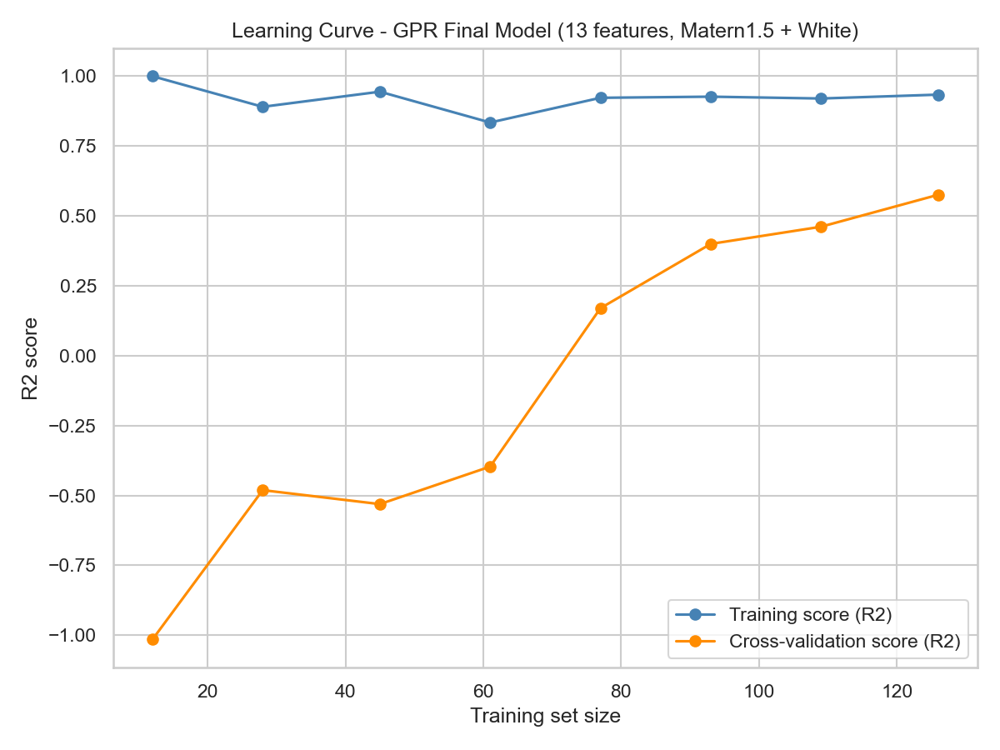

# GPR Descriptor Model - Final Model Report (Step 7 Replacement)

Step 7 (`results/RDKit_GPR_Pruning_Report.md` in the parent `Final Model` folder) showed that a Gaussian Process Regressor (GPR, Matern(nu=1.5) + WhiteKernel, StandardScaler-normalized) on the same 13-descriptor feature set as the XGBoost final model improves the nested-CV generalization estimate from R2=0.5050 [0.3342, 0.6757] (XGBoost, Steps 4/5) to R2=0.5798 [0.5067, 0.6530] (GPR), with a substantially tighter confidence interval. Every outer fold in the nested CV selected the Matern(1.5)+White kernel, so it is fixed as the final kernel here. The model was refit on the full 154-sample dataset for deployment/reporting, and all interpretability and diagnostic plots were regenerated against this final model. The Step 7 nested-CV scores remain the headline generalization metric for this model; the full-data fit and OOF metrics below are diagnostic only.

Feature columns (13): MolWt, LogP, TPSA, NumHDonors, NumHAcceptors, NumRotatableBonds, RingCount, NumAromaticRings, FractionCSP3, MolMR, HeavyAtomCount, NumAliphaticRings, BertzCT

Final kernel (fitted): `1.51**2 * Matern(length_scale=3.54, nu=1.5) + WhiteKernel(noise_level=0.153)`

Pipeline: `StandardScaler -> GaussianProcessRegressor(normalize_y=True, n_restarts_optimizer=5)`

## Headline Generalization Metric (Step 7, Nested CV)

| Metric | Model | Mean | 95% CI Lower | 95% CI Upper |
|---|---|---|---|---|
| RMSE | GPR (final) | 0.8111 | 0.7194 | 0.9029 |
| MAE | GPR (final) | 0.6176 | 0.5584 | 0.6768 |
| R2 | GPR (final) | 0.5798 | 0.5067 | 0.6530 |
| RMSE | XGBoost (Step 4/5, prior model) | 0.8721 | 0.7238 | 1.0203 |
| MAE | XGBoost (Step 4/5, prior model) | 0.6699 | 0.5292 | 0.8107 |
| R2 | XGBoost (Step 4/5, prior model) | 0.5050 | 0.3342 | 0.6757 |

## Diagnostic Metrics (Final Model, Not Generalization Estimates)

| Set | RMSE | MAE | R2 | Pearson r |
|---|---|---|---|---|
| Full-data fit (refit model) | 0.3476 | 0.2700 | 0.9253 | 0.9660 |
| OOF (5-fold SGKF, final kernel) | 0.8134 | 0.6173 | 0.5909 | 0.7709 |

Mean predictive standard deviation (full-data fit): 0.6100

## SHAP Ranking (Mean |SHAP value|, Final Model, KernelExplainer)

| Rank | Descriptor | Mean |SHAP value| |
|---|---|---|
| 1 | TPSA | 0.4703 |
| 2 | LogP | 0.3533 |
| 3 | MolMR | 0.3026 |
| 4 | MolWt | 0.2974 |
| 5 | NumHDonors | 0.2348 |
| 6 | NumHAcceptors | 0.1957 |
| 7 | BertzCT | 0.1329 |
| 8 | FractionCSP3 | 0.1188 |
| 9 | RingCount | 0.1155 |
| 10 | HeavyAtomCount | 0.0811 |
| 11 | NumRotatableBonds | 0.0668 |
| 12 | NumAromaticRings | 0.0572 |
| 13 | NumAliphaticRings | 0.0393 |

## Diagnostic Plots

## Output Files

- Final model (refit on all 154 samples): `model/gpr_model.pkl`
- Parity/residual plot: `results/GPR/parity_residual_plots_with_stats.png`
- SHAP plots: `results/GPR/shap_summary.png`, `results/GPR/shap_importance_bar.png`
- Learning curve: `results/GPR/learning_curve.png`
