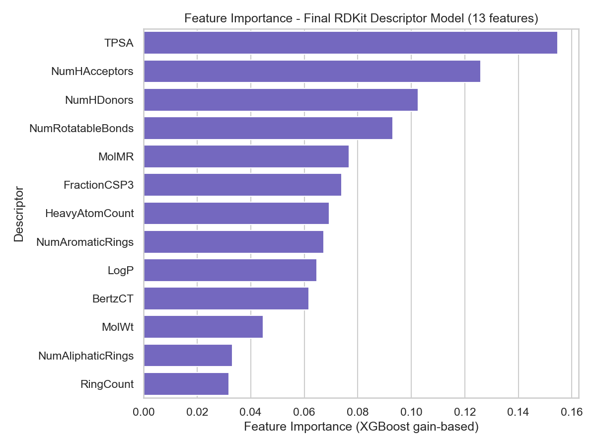
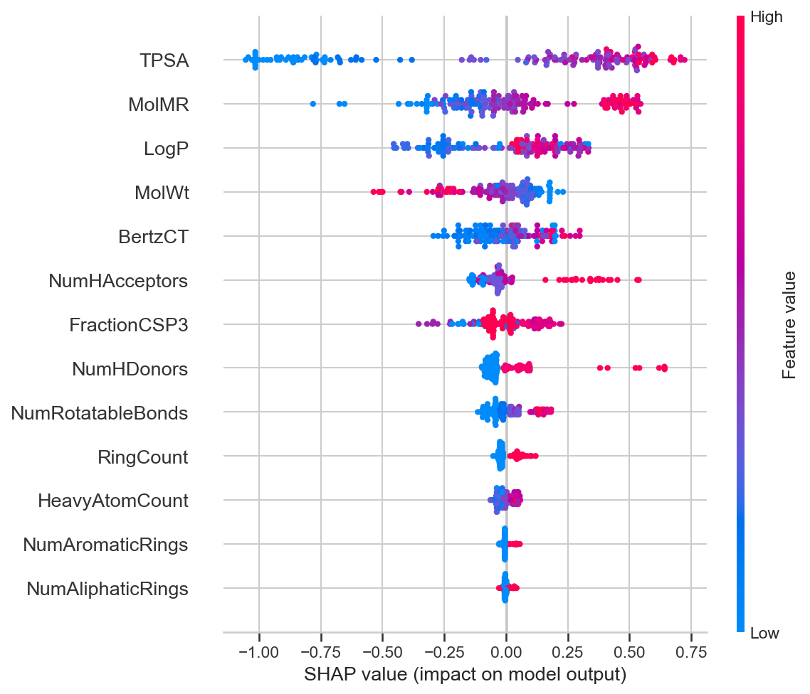
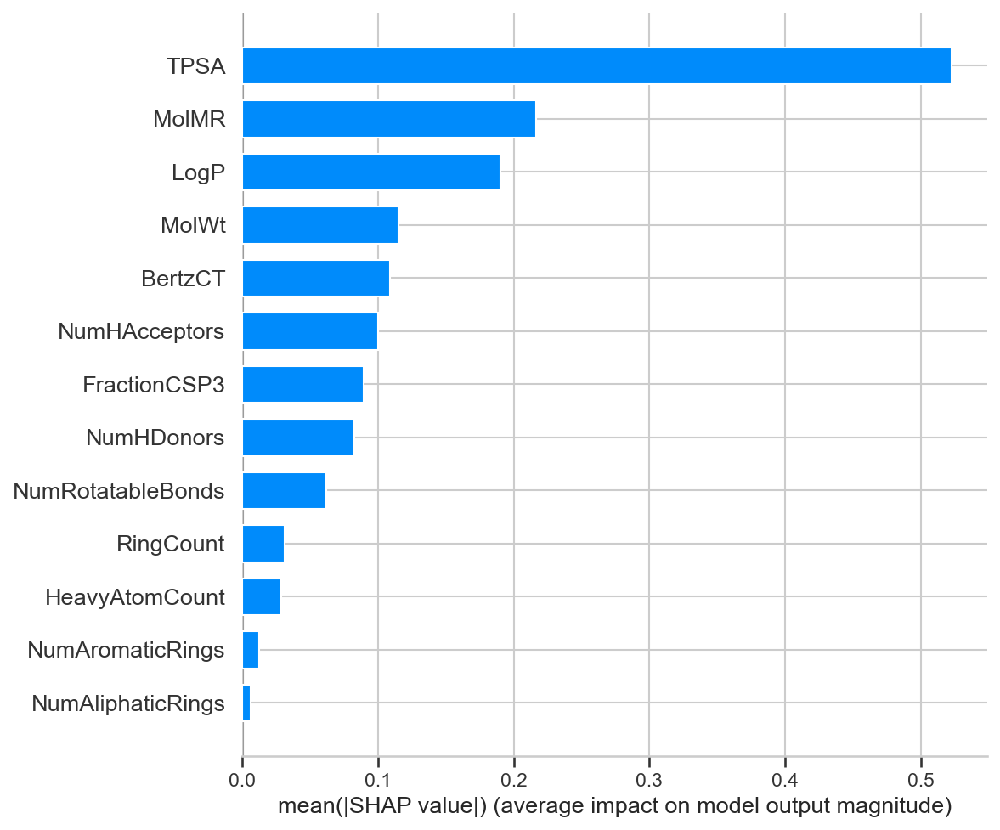

# RDKit Descriptor Model - Descriptor Expansion Check (Step 2)

Step 2 of the fine-tuning plan: evaluate the expanded 13-descriptor feature set (original 7 + NumAromaticRings, FractionCSP3, MolMR, HeavyAtomCount, NumAliphaticRings, BertzCT) using the current best hyperparameters (`model/rdkit_best_params.json`) under the Step 1 StratifiedGroupKFold split, without re-running the hyperparameter search.

Feature columns (13): MolWt, LogP, TPSA, NumHDonors, NumHAcceptors, NumRotatableBonds, RingCount, NumAromaticRings, FractionCSP3, MolMR, HeavyAtomCount, NumAliphaticRings, BertzCT

Hyperparameters used: `{'subsample': 0.7, 'n_estimators': 500, 'min_child_weight': 1, 'max_depth': 3, 'learning_rate': 0.01, 'colsample_bytree': 0.8}`

## Results Comparison

| Step | Set | RMSE | MAE | R2 |
|---|---|---|---|---|
| Step 1 (7 features) | Train | 0.4916 | 0.3805 | 0.8483 |
| Step 1 (7 features) | Test | 1.0991 | 0.8783 | 0.2621 |
| Step 1 (7 features) | OOF | 0.9169 | 0.7032 | 0.4801 |
| Step 2 (13 features) | Train | 0.4198 | 0.3266 | 0.8893 |
| Step 2 (13 features) | Test | 1.0625 | 0.8568 | 0.3105 |
| Step 2 (13 features) | OOF | 0.8881 | 0.6778 | 0.5123 |

## Train-CV R2 Gap

- Step 1 gap (7 features): 0.3682
- Step 2 gap (13 features): 0.3770
- Change: +0.0088

## Step 2 Success Check

- OOF R2 improved or flat vs Step 1: True (0.5123 vs 0.4801)
- Train-CV gap did not widen vs Step 1: False (0.3770 vs 0.3682)
- **Overall: FAIL**

## Feature Importance (XGBoost Gain-Based)

| Rank | Descriptor | Importance |
|---|---|---|
| 1 | TPSA | 0.1778 |
| 2 | NumHAcceptors | 0.1412 |
| 3 | NumRotatableBonds | 0.1069 |
| 4 | MolMR | 0.0820 |
| 5 | HeavyAtomCount | 0.0801 |
| 6 | NumHDonors | 0.0756 |
| 7 | LogP | 0.0732 |
| 8 | BertzCT | 0.0611 |
| 9 | NumAromaticRings | 0.0503 |
| 10 | MolWt | 0.0461 |
| 11 | FractionCSP3 | 0.0438 |
| 12 | RingCount | 0.0331 |
| 13 | NumAliphaticRings | 0.0287 |

## SHAP Ranking (Mean |SHAP value|)

| Rank | Descriptor | Mean |SHAP value| |
|---|---|---|
| 1 | TPSA | 0.6143 |
| 2 | LogP | 0.2571 |
| 3 | MolMR | 0.2300 |
| 4 | MolWt | 0.1309 |
| 5 | BertzCT | 0.1063 |
| 6 | NumHAcceptors | 0.0858 |
| 7 | NumRotatableBonds | 0.0624 |
| 8 | NumHDonors | 0.0518 |
| 9 | FractionCSP3 | 0.0490 |
| 10 | RingCount | 0.0240 |
| 11 | HeavyAtomCount | 0.0229 |
| 12 | NumAromaticRings | 0.0098 |
| 13 | NumAliphaticRings | 0.0024 |

## New Descriptor Ranks (SHAP)

| Descriptor | SHAP Rank (of 13) |
|---|---|
| NumAromaticRings | 12 |
| FractionCSP3 | 9 |
| MolMR | 3 |
| HeavyAtomCount | 11 |
| NumAliphaticRings | 13 |
| BertzCT | 5 |

**Conclusion:** The expanded descriptor set fails the Step 2 success check. Consider dropping the lowest-ranked new descriptors (see SHAP ranks above) and re-checking, or revert to the original 7-descriptor set.
