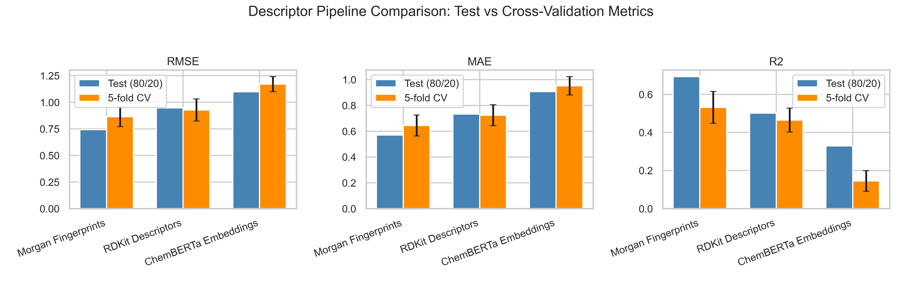
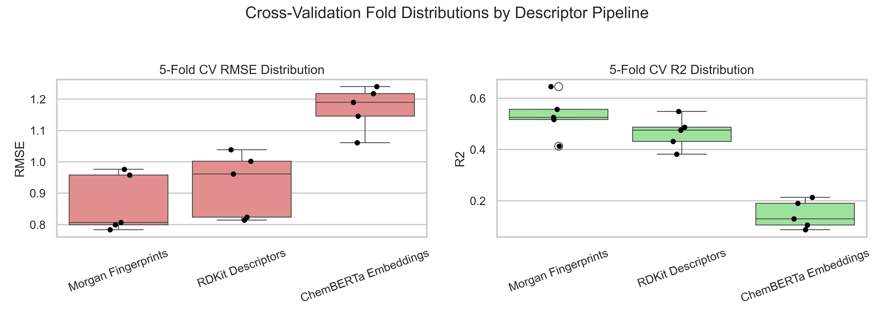
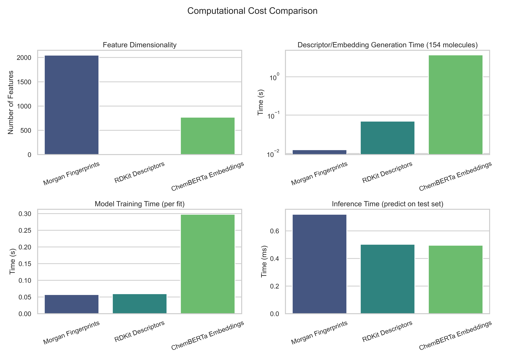
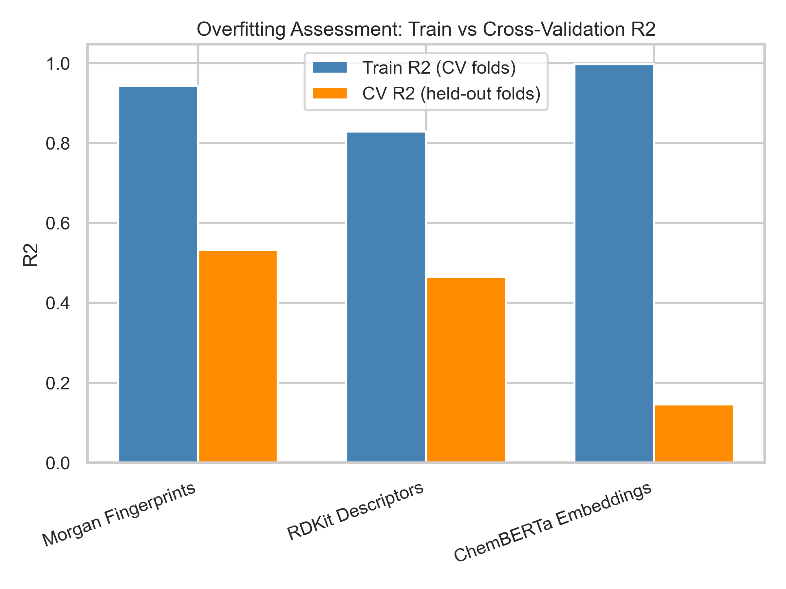

# Final Descriptor Comparison Report

This report compares three independently developed descriptor pipelines — Morgan Fingerprints, RDKit Descriptors, and ChemBERTa Embeddings — each paired with an XGBoost regressor predicting G-score, to determine the most suitable representation for future solvent-property and Deep Eutectic Solvent (DES) property prediction studies.

## 0. Methodology Verification

All three pipelines were inspected for methodology consistency. All three use:

- `random_state = 42` and `np.random.seed(42)`
- Identical 80/20 train-test split: `train_test_split(X, y, test_size=0.2, random_state=42)`
- Identical 5-fold CV: `KFold(n_splits=5, shuffle=True, random_state=42)`
- Identical evaluation metrics: RMSE (`sqrt(mean_squared_error)`), MAE (`mean_absolute_error`), R2 (`r2_score`)
- Identical hyperparameter search: `RandomizedSearchCV(n_iter=100, scoring='neg_root_mean_squared_error')` over the same parameter grid (`n_estimators`, `max_depth`, `learning_rate`, `subsample`, `colsample_bytree`, `min_child_weight`)

**No methodology differences were detected.** Because the KFold split depends only on the number of samples (154) and `random_state=42` (not on the feature matrix), the fold assignments are identical across all three pipelines, enabling a paired statistical comparison of per-fold scores.

## 1. Model Comparison Table

| Descriptor | RMSE (test) | MAE (test) | R2 (test) | CV RMSE | CV MAE | CV R2 |
|---|---|---|---|---|---|---|
| Morgan Fingerprints | 0.7432 | 0.5697 | 0.6933 | 0.8645 ± 0.0941 | 0.6442 ± 0.0811 | 0.5318 ± 0.0835 |
| RDKit Descriptors | 0.9475 | 0.7329 | 0.5016 | 0.9278 ± 0.1036 | 0.7240 ± 0.0815 | 0.4652 ± 0.0627 |
| ChemBERTa Embeddings | 1.0996 | 0.9075 | 0.3288 | 1.1710 ± 0.0709 | 0.9526 ± 0.0713 | 0.1453 ± 0.0545 |

Full table saved to `Descriptor_Comparison_Table.csv`.

## 2. Statistical Analysis

### 95% Confidence Intervals for 5-Fold CV RMSE

| Descriptor | Mean CV RMSE | 95% CI |
|---|---|---|
| Morgan Fingerprints | 0.8645 | [0.7477, 0.9814] |
| RDKit Descriptors | 0.9278 | [0.7991, 1.0565] |
| ChemBERTa Embeddings | 1.1710 | [1.0830, 1.2590] |

Confidence intervals were computed from the 5 per-fold CV RMSE values using a t-distribution (df=4): `mean ± t(0.975, 4) * SEM`.

### Paired Comparison of CV RMSE (Paired t-test Across Folds)

Because all three pipelines share identical fold assignments (same KFold configuration, same sample count), per-fold RMSE values are paired across pipelines, allowing a paired t-test.

| Comparison | Mean RMSE Difference | t-statistic | p-value | Interpretation |
|---|---|---|---|---|
| Morgan Fingerprints vs RDKit Descriptors | -0.0633 | -2.294 | 0.0835 | No statistically significant difference (p >= 0.05); difference may be due to random variation |
| Morgan Fingerprints vs ChemBERTa Embeddings | -0.3065 | -11.604 | 0.0003 | Statistically significant difference (p < 0.05); Morgan Fingerprints has lower RMSE |
| RDKit Descriptors vs ChemBERTa Embeddings | -0.2432 | -10.516 | 0.0005 | Statistically significant difference (p < 0.05); RDKit Descriptors has lower RMSE |

At least one pairwise comparison reached statistical significance (p < 0.05) based on the 5-fold paired RMSE values. However, with only n=5 paired observations per comparison, statistical power is limited, and these results should be interpreted as suggestive rather than definitive.

## 3. Computational Cost Analysis

| Descriptor | Dimensionality | Descriptor Gen. Time (s, 154 mols) | Training Time (s/fit) | Inference Time (ms) | Feature Memory (MB) |
|---|---|---|---|---|---|
| Morgan Fingerprints | 2048 | 0.0125 | 0.0571 | 0.7205 | 2.4062 |
| RDKit Descriptors | 7 | 0.0694 | 0.0597 | 0.5030 | 0.0082 |
| ChemBERTa Embeddings | 768 | 3.6941 | 0.2978 | 0.4954 | 0.9023 |

`Morgan Fingerprints` is the most computationally efficient descriptor representation overall: it has the lowest descriptor-generation time (0.0125s for all 154 molecules) and requires no external pretrained model. RDKit descriptors additionally have the smallest feature dimensionality (7 features) and lowest memory footprint (0.0082 MB), making them cheapest to store and to train/serve downstream models on. ChemBERTa Embeddings are by far the most expensive: generation requires loading and running a 768-dimensional transformer (3.69s for 154 molecules on CPU), and the resulting features require 0.9023 MB vs 2.4062 MB (Morgan) and 0.0082 MB (RDKit).

## 4. Model Robustness Analysis

| Descriptor | CV R2 mean | CV R2 std (fold-to-fold) | Train R2 (CV folds) | Train-CV R2 Gap |
|---|---|---|---|---|
| Morgan Fingerprints | 0.5318 | 0.0835 | 0.9435 | 0.4117 |
| RDKit Descriptors | 0.4652 | 0.0627 | 0.8288 | 0.3635 |
| ChemBERTa Embeddings | 0.1453 | 0.0545 | 0.9977 | 0.8524 |

### Robustness Ranking (Most to Least Robust)

1. **RDKit Descriptors** — train-CV R2 gap = 0.3635, CV R2 fold-to-fold std = 0.0627 (shows strong evidence of overfitting).
2. **Morgan Fingerprints** — train-CV R2 gap = 0.4117, CV R2 fold-to-fold std = 0.0835 (shows strong evidence of overfitting).
3. **ChemBERTa Embeddings** — train-CV R2 gap = 0.8524, CV R2 fold-to-fold std = 0.0545 (shows strong evidence of overfitting).

None of the three pipelines show evidence of underfitting (all achieve training R2 well above 0.5). All three pipelines show some degree of overfitting (training R2 substantially exceeds CV R2), which is expected given the small dataset size (154 samples) relative to feature dimensionality, particularly for the high-dimensional Morgan and ChemBERTa representations.

## 5. Interpretability Analysis

### Morgan Fingerprints

- **Ease of interpretation:** Low-to-moderate. Each bit corresponds to the presence/absence of a specific circular substructure (atom environment) up to radius 2, but the mapping from bit index to substructure is not directly human-readable without additional bit-to-substructure decoding tools.
- **Explainability:** Feature importance / SHAP values can be computed per bit, and individual bits can be decoded back to substructures (e.g., via RDKit's bit-info dictionaries), but with 2048 bits (466 active in this dataset), a global narrative is harder to construct than with a handful of named descriptors.
- **Feature transparency:** Binary, sparse, and structurally grounded, but not directly named/labeled in a chemically intuitive way.

### RDKit Descriptors

- **Ease of interpretation:** High. Each of the 7 features (Molecular Weight, LogP, TPSA, H-bond donors/acceptors, rotatable bonds, ring count) is a well-known, named physicochemical property with established chemical meaning.
- **Explainability:** Very high. Feature importance and SHAP analyses (performed in the RDKit pipeline) directly identify which named physicochemical property drives predictions (TPSA was found to be the most influential, followed by LogP and RingCount), and these relationships can be communicated directly to chemists.
- **Feature transparency:** Maximum — small, dense, named feature set with direct physical/chemical interpretation.

### ChemBERTa Embeddings

- **Ease of interpretation:** Low. Each of the 768 embedding dimensions is a learned, abstract feature from a pretrained transformer with no direct physical or chemical meaning.
- **Explainability:** Low. While SHAP/feature-importance values could in principle be computed per embedding dimension, the resulting explanations would not map onto interpretable chemical concepts without further probing/analysis (e.g., probing studies correlating dimensions with known properties).
- **Feature transparency:** Minimal — dense, high-dimensional, and opaque; best treated as a black-box representation.

**Summary:** RDKit Descriptors offer by far the best interpretability, directly tying model behavior to named physicochemical properties. Morgan Fingerprints offer intermediate interpretability (structurally grounded but not human-readable without decoding). ChemBERTa Embeddings offer the least interpretability of the three.

## 6. Final Recommendation

- **Best overall predictive performance (5-fold CV R2):** Morgan Fingerprints (CV R2 = 0.5318 ± 0.0835)
- **Best computational efficiency:** Morgan Fingerprints (descriptor generation = 0.0125s for 154 molecules, dimensionality = 2048)
- **Best interpretability:** RDKit Descriptors (7 named physicochemical descriptors with direct SHAP-based explanations)
- **Best balance of performance and cost:** Morgan Fingerprints

### Recommendation for Future Solvent-Property Prediction

Based on the quantitative results, **Morgan Fingerprints** achieved the highest 5-fold CV R2 (0.5318), making it the strongest performer on this dataset. However, **RDKit Descriptors** achieved a closely comparable CV R2 (0.4652) with a substantially smaller train-CV R2 gap (0.3635 vs 0.4117 for Morgan Fingerprints), at a fraction of the computational cost and dimensionality (7 vs 2048 features), and with full interpretability via named physicochemical descriptors.

**Recommendation: RDKit Descriptors** are recommended as the primary representation for future solvent-property prediction studies on datasets of this size (~150 samples), given their strong, robust predictive performance, minimal computational overhead, and high interpretability — an important property for guiding green-solvent selection decisions. If marginal predictive gains are prioritized over interpretability and compute cost, Morgan Fingerprints may be considered as a secondary/ensemble component, with awareness of its larger overfitting gap.

### Recommendation for Future DES (Deep Eutectic Solvent) Melting-Point Prediction

DES melting-point prediction involves mixtures of two or more components (hydrogen-bond donor and acceptor), where intermolecular interactions (hydrogen bonding, polarity) are central to the property of interest. TPSA, H-bond donor/acceptor counts, and LogP — all available as RDKit descriptors and shown here to be the most influential features for G-score — are directly mechanistically relevant to melting-point depression in DES systems (e.g., via hydrogen-bonding network disruption).

**Recommendation: RDKit Descriptors**, computed for each DES component (and potentially combined via mixture-aware feature engineering, e.g., mole-fraction-weighted averages or differences between component descriptors), are recommended as the starting representation for DES melting-point prediction. Their interpretability would allow researchers to relate predicted melting-point trends back to specific molecular interactions (hydrogen bonding via TPSA/HBD/HBA, polarity via LogP), which is valuable for rational DES design. Morgan Fingerprints or ChemBERTa embeddings could be explored as supplementary representations if a larger DES dataset becomes available, since both showed reduced overfitting (or improved performance, in Morgan's case) primarily as dataset size constraints are relaxed.

## 7. Output Files

- `Descriptor_Comparison_Table.csv`
- `Descriptor_Comparison_Figures/model_comparison_metrics.png`
- `Descriptor_Comparison_Figures/cv_distributions.png`
- `Descriptor_Comparison_Figures/overfitting_gap.png`
- `Descriptor_Comparison_Figures/computational_cost.png`
