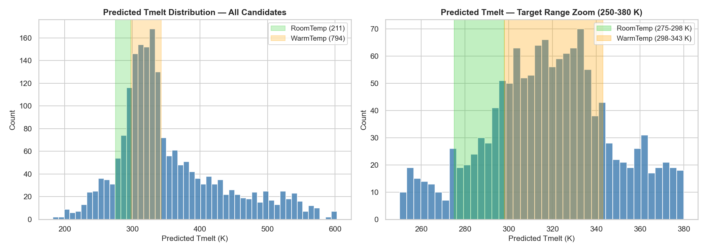
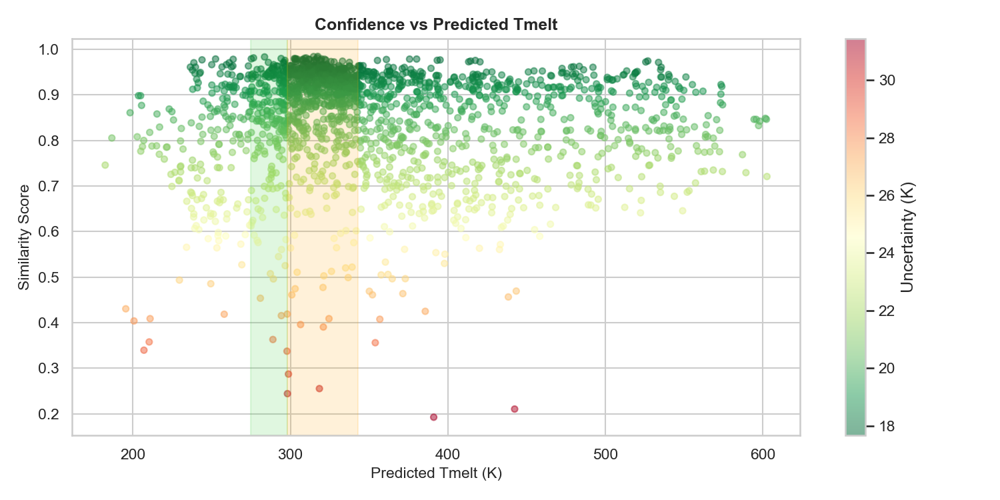
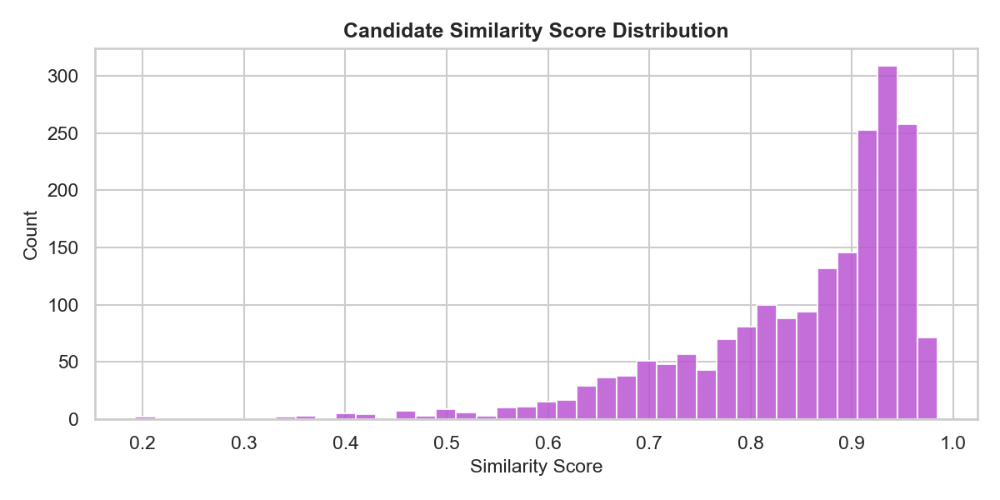

# Candidate Screening Report

*Generated: 2026-06-17 10:36*

*Model: `xgboost_optimized.pkl` | Dataset: `Melting_temperature_appended_35il_03082026.csv`*

## 1. Screening Summary
| Metric | Value |
|---|---|
| Total candidates loaded | 2006 |
| Rejected (validation) | 0 |
| Candidates evaluated | 2006 |
| DES rule violations (Tmelt >= T#1 or T#2) | 738 |
| Physically unreasonable (<100 K or >700 K) | 0 |
| RoomTemp candidates (275–298 K) | 211 |
| WarmTemp candidates (298–343 K) | 794 |
| High-uncertainty predictions (>25 K) | 54 |
| Feature extrapolation flags | 0 |

### Screening Status Breakdown
| Status | Count |
|---|---|
| REJECTED_DES_RULE | 738 |
| PASS_WARMTEMP | 574 |
| OUTSIDE_TARGET_RANGE | 506 |
| PASS_ROOMTEMP | 188 |

## 2. Temperature Distributions

## 3. Confidence vs Predicted Tmelt

## 4. Similarity Score Distribution

## 5. Physical Screening Rules
**Rule**: `Predicted Tmelt < T#1` AND `Predicted Tmelt < T#2`

This enforces the fundamental DES criterion: a deep eutectic solvent melts below the melting points of both pure components.
- 1878 candidates pass the T#1 rule
- 1395 candidates pass the T#2 rule
- 1268 candidates pass both rules

## 6. Ranking Methodology
Candidates are ranked by a composite score (0–100):

| Component | Weight | Description |
|---|---|---|
| Confidence (similarity) | 40% | k-NN similarity to training data |
| Temperature proximity | 30% | Closeness to target range center |
| Physical plausibility | 20% | Passes DES rule (Tmelt < T#1 and T#2) |
| Feature validity | 10% | No numeric feature extrapolation |

## 7. Top 25 RoomTemp Candidates (275–298 K)
*211 total candidates in this range — showing top 25 by ranking score.*

| Rank | Component#1 | Component#2 | X#1 | Pred Tmelt (K) | Similarity | Uncert (K) | Score | DES Rule |
|---|---|---|---|---|---|---|---|---|
| 1 | 2-hydroxyethyl(trimethyl)azani | propanedioic acid | 0.500 | 286.03 | 0.971 | 17.9 | 98.4 | Yes |
| 2 | trioctylphosphine oxide | (1R,2S,5R)-5-methyl-2-propan-2 | 0.349 | 286.20 | 0.950 | 18.3 | 97.7 | Yes |
| 3 | 1,3-dithiane | 1,2,3,4-tetrafluoro-5,6-diiodo | 0.496 | 286.98 | 0.953 | 18.2 | 97.7 | Yes |
| 4 | (1R,2S,5R)-5-methyl-2-propan-2 | octanoic acid | 0.698 | 286.54 | 0.939 | 18.5 | 97.5 | Yes |
| 5 | (1R,2S,5R)-5-methyl-2-propan-2 | 3-phenylpropanoic acid | 0.600 | 285.97 | 0.948 | 18.3 | 97.4 | Yes |
| 6 | (1R,2S,5R)-5-methyl-2-propan-2 | octanoic acid | 0.100 | 286.05 | 0.940 | 18.4 | 97.2 | Yes |
| 7 | 5-methyl-2-propan-2-ylphenol | (1R,2S,5R)-5-methyl-2-propan-2 | 0.700 | 283.60 | 0.983 | 17.7 | 96.8 | Yes |
| 8 | (1R,2S,5R)-5-methyl-2-propan-2 | cyclohexanecarboxylic acid | 0.700 | 287.74 | 0.946 | 18.3 | 96.8 | Yes |
| 9 | (1R,2S,5R)-5-methyl-2-propan-2 | decanoic acid | 0.698 | 288.28 | 0.958 | 18.1 | 96.7 | Yes |
| 10 | (1R,2S,5R)-5-methyl-2-propan-2 | decanoic acid | 0.700 | 288.62 | 0.958 | 18.1 | 96.5 | Yes |
| 11 | (1R,2S,5R)-5-methyl-2-propan-2 | decanoic acid | 0.500 | 284.95 | 0.943 | 18.4 | 96.3 | Yes |
| 12 | trioctylphosphine oxide | (1R,2S,5R)-5-methyl-2-propan-2 | 0.207 | 289.38 | 0.966 | 18.0 | 96.1 | Yes |
| 13 | (1R,2S,5R)-5-methyl-2-propan-2 | 3-cyclohexylpropanoic acid | 0.100 | 284.56 | 0.944 | 18.4 | 96.1 | Yes |
| 14 | 5-methyl-2-propan-2-ylphenol | decanoic acid | 0.490 | 288.38 | 0.942 | 18.4 | 96.0 | Yes |
| 15 | 5-methyl-2-propan-2-ylphenol | tetradecan-1-ol | 0.499 | 289.38 | 0.962 | 18.1 | 95.9 | Yes |
| 16 | (1R,2S,5R)-5-methyl-2-propan-2 | 3-cyclohexylpropanoic acid | 0.700 | 288.67 | 0.944 | 18.4 | 95.8 | Yes |
| 17 | 2-hydroxyethyl(trimethyl)azani | urea | 0.333 | 286.19 | 0.899 | 19.2 | 95.7 | Yes |
| 18 | 5-methyl-2-propan-2-ylphenol | decanoic acid | 0.500 | 289.56 | 0.956 | 18.2 | 95.6 | Yes |
| 19 | 5-methyl-2-propan-2-ylphenol | octanoic acid | 0.100 | 285.06 | 0.918 | 18.8 | 95.4 | Yes |
| 20 | decanoic acid | (Z)-octadec-9-enoic acid | 0.100 | 285.41 | 0.909 | 19.0 | 95.4 | Yes |
| 21 | (1R,2S,5R)-5-methyl-2-propan-2 | octanoic acid | 0.200 | 283.95 | 0.940 | 18.4 | 95.4 | Yes |
| 22 | (1R,2S,5R)-5-methyl-2-propan-2 | tetradecan-1-ol | 0.700 | 289.43 | 0.945 | 18.4 | 95.2 | Yes |
| 23 | tetrabutylazanium;chloride | tetradecanoic acid | 0.506 | 284.82 | 0.906 | 19.0 | 94.8 | Yes |
| 24 | 5-methyl-2-propan-2-ylphenol | octanoic acid | 0.500 | 283.97 | 0.921 | 18.8 | 94.6 | Yes |
| 25 | 5-methyl-2-propan-2-ylphenol | undec-10-enoic acid | 0.600 | 289.81 | 0.936 | 18.5 | 94.5 | Yes |

## 8. Top 25 WarmTemp Candidates (298–343 K)
*794 total candidates in this range — showing top 25 by ranking score.*

| Rank | Component#1 | Component#2 | X#1 | Pred Tmelt (K) | Similarity | Uncert (K) | Score | DES Rule |
|---|---|---|---|---|---|---|---|---|
| 1 | hexadecan-1-ol | 5-methyl-2-propan-2-ylphenol | 0.897 | 320.83 | 0.960 | 18.1 | 98.1 | Yes |
| 2 | octadecan-1-ol | 5-methyl-2-propan-2-ylphenol | 0.600 | 320.58 | 0.949 | 18.3 | 97.9 | Yes |
| 3 | 2-hydroxyethyl(trimethyl)azani | hexadecan-1-ol | 0.408 | 321.28 | 0.961 | 18.1 | 97.8 | Yes |
| 4 | 2-hydroxyethyl(trimethyl)azani | hexadecan-1-ol | 0.396 | 321.43 | 0.962 | 18.1 | 97.7 | Yes |
| 5 | 2-hydroxyethyl(trimethyl)azani | N-(4-hydroxyphenyl)acetamide | 0.504 | 320.25 | 0.944 | 18.4 | 97.5 | Yes |
| 6 | 5-methyl-2-propan-2-ylphenol | tetradecanoic acid | 0.300 | 319.68 | 0.956 | 18.2 | 97.5 | Yes |
| 7 | 2-hydroxyethyl(trimethyl)azani | 1-ethyl-3-methylimidazol-3-ium | 0.299 | 321.71 | 0.961 | 18.1 | 97.4 | Yes |
| 8 | hexadecanoic acid | tetradecanoic acid | 0.302 | 320.40 | 0.933 | 18.6 | 97.2 | Yes |
| 9 | tetraethylazanium;chloride | hexadecanoic acid | 0.406 | 320.80 | 0.936 | 18.5 | 97.2 | Yes |
| 10 | tetrapropylazanium;chloride | hexadecanoic acid | 0.406 | 321.17 | 0.943 | 18.4 | 97.1 | Yes |
| 11 | tetrabutylazanium;chloride | octadecan-1-ol | 0.595 | 320.82 | 0.933 | 18.6 | 97.0 | Yes |
| 12 | 2-hydroxyethyl(trimethyl)azani | hexadecan-1-ol | 0.306 | 322.38 | 0.965 | 18.0 | 96.9 | Yes |
| 13 | hexadecanoic acid | tetradecanoic acid | 0.396 | 320.95 | 0.931 | 18.6 | 96.9 | Yes |
| 14 | 2-hydroxyethyl(trimethyl)azani | 1-ethyl-3-methylimidazol-3-ium | 0.301 | 322.29 | 0.961 | 18.1 | 96.9 | Yes |
| 15 | 5-methyl-2-propan-2-ylphenol | hexadecanoic acid | 0.600 | 320.99 | 0.932 | 18.6 | 96.8 | Yes |
| 16 | tetramethylazanium;chloride | tetradecanoic acid | 0.205 | 319.51 | 0.940 | 18.4 | 96.7 | Yes |
| 17 | tetramethylazanium;chloride | tetradecanoic acid | 0.303 | 321.76 | 0.946 | 18.3 | 96.7 | Yes |
| 18 | hexadecan-1-ol | 5-methyl-2-propan-2-ylphenol | 0.100 | 318.44 | 0.961 | 18.1 | 96.6 | Yes |
| 19 | 1,3-dithiane | 1,2,3,4-tetrafluoro-5,6-diiodo | 0.198 | 318.39 | 0.961 | 18.1 | 96.6 | Yes |
| 20 | 2-hydroxyethyl(trimethyl)azani | benzyl-(2-hydroxyethyl)-dimeth | 0.303 | 318.34 | 0.959 | 18.1 | 96.5 | Yes |
| 21 | tetraethylazanium;chloride | tetradecanoic acid | 0.206 | 320.24 | 0.914 | 18.9 | 96.4 | Yes |
| 22 | 1,3-dithiane | 1,2,3,4-tetrafluoro-5,6-diiodo | 0.898 | 322.95 | 0.963 | 18.1 | 96.3 | Yes |
| 23 | hexadecan-1-ol | 5-methyl-2-propan-2-ylphenol | 0.797 | 318.58 | 0.949 | 18.3 | 96.3 | Yes |
| 24 | 2-hydroxyethyl(trimethyl)azani | 2,3-dimethylphenol | 0.332 | 322.29 | 0.945 | 18.4 | 96.2 | Yes |
| 25 | tetrabutylazanium;chloride | octadecan-1-ol | 0.303 | 319.09 | 0.933 | 18.6 | 96.1 | Yes |

## 9. Potential Risks & Limitations
| Risk | Description | Mitigation |
|---|---|---|
| Overfitting residual | Train R²=0.9999 vs CV R²=0.9504 | Use CV metrics, not train metrics, for reliability assessment |
| No molecular descriptors | Model ignores chemical structure — isomers with same T#1/T#2/composition get identical predictions | Add RDKit descriptors (awaiting approval) |
| Extrapolated candidates | Any candidates outside training feature range may have unreliable predictions | Check `feature_extrapolation` flag |
| Dataset bias | Training data skewed toward specific DES classes (Type III dominates) | Interpret predictions for underrepresented classes with caution |
| T#1/T#2 missing values | Imputed with median — screening rule may be unreliable for these | Verify T#1/T#2 from literature before synthesis |

## 10. Recommended Candidates for Experimental Validation
Priority order for experimental follow-up:
1. **High-confidence RoomTemp candidates**: similarity_score > 0.7, passes DES rule, no extrapolation flag
2. **High-confidence WarmTemp candidates**: same criteria
3. **Structurally diverse candidates**: prioritise novel chemical classes underrepresented in training data

> Full candidate details: `CSVs/Candidate_Master_List.csv`
> Flagged extrapolations: `CSVs/Extrapolation_Flagged.csv`