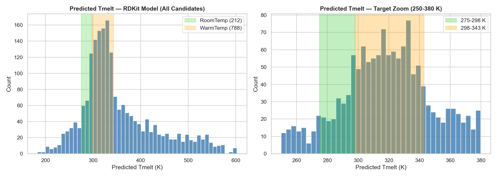
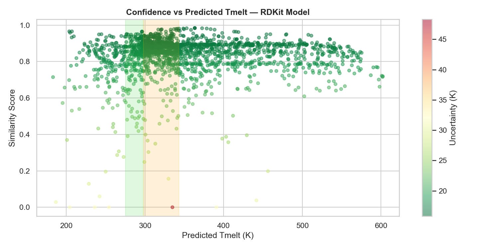

# Candidate Screening Report — RDKit Model

*Generated: 2026-06-17 10:43*

*Model: `xgboost_rdkit_optimized.pkl` | CV RMSE: 15.55 K*

## 1. Screening Summary
| Metric | Value |
|---|---|
| Candidates evaluated | 2006 |
| DES rule violations | 743 |
| Physically unreasonable | 0 |
| RoomTemp candidates (275-298 K) | 212 |
| WarmTemp candidates (298-343 K) | 788 |
| High-uncertainty predictions (>25 K) | 24 |
| Feature extrapolation flags | 5 |

### Status Breakdown
| Status | Count |
|---|---|
| REJECTED_DES_RULE | 743 |
| PASS_WARMTEMP | 569 |
| OUTSIDE_TARGET_RANGE | 507 |
| PASS_ROOMTEMP | 187 |

## 2. Temperature Distributions

## 3. Confidence vs Predicted Tmelt

## 4. Physical Screening Rules
**Rule**: `Predicted Tmelt < T#1` AND `Predicted Tmelt < T#2`
- 1877 candidates pass T#1 rule
- 1391 candidates pass T#2 rule
- 1263 candidates pass both rules

## 5. Ranking Methodology
| Component | Weight |
|---|---|
| Prediction confidence (k-NN similarity) | 40% |
| Temperature proximity to range center | 30% |
| Physical plausibility (DES rule) | 20% |
| Feature validity (no extrapolation) | 10% |

## 6. Top 25 RoomTemp Candidates (275-298 K)
*212 total in range. Showing top 25 by ranking score.*

| Rank | Component#1 | Component#2 | X#1 | Pred Tmelt (K) | Similarity | Uncert (K) | Score | DES Rule |
|---|---|---|---|---|---|---|---|---|
| 1 | (1R,2S,5R)-5-methyl-2-propan | decanoic acid | 0.500 | 285.86 | 0.938 | 16.5 | 96.9 | Yes |
| 2 | 5-methyl-2-propan-2-ylphenol | decanoic acid | 0.490 | 288.41 | 0.950 | 16.3 | 96.3 | Yes |
| 3 | (1R,2S,5R)-5-methyl-2-propan | decanoic acid | 0.698 | 287.93 | 0.934 | 16.6 | 96.1 | Yes |
| 4 | (1R,2S,5R)-5-methyl-2-propan | decanoic acid | 0.700 | 288.13 | 0.934 | 16.6 | 95.9 | Yes |
| 5 | 2-hydroxyethyl(trimethyl)aza | 2-methylphenol | 0.091 | 284.44 | 0.919 | 16.8 | 94.9 | Yes |
| 6 | (1R,2S,5R)-5-methyl-2-propan | octanoic acid | 0.698 | 286.96 | 0.881 | 17.4 | 94.8 | Yes |
| 7 | (1R,2S,5R)-5-methyl-2-propan | octanoic acid | 0.100 | 286.21 | 0.876 | 17.5 | 94.8 | Yes |
| 8 | 5-methyl-2-propan-2-ylphenol | decanoic acid | 0.450 | 289.10 | 0.927 | 16.7 | 94.8 | Yes |
| 9 | (1R,2S,5R)-5-methyl-2-propan | 3-phenylpropanoic acid | 0.600 | 286.39 | 0.866 | 17.6 | 94.5 | Yes |
| 10 | 5-methyl-2-propan-2-ylphenol | decanoic acid | 0.500 | 290.72 | 0.951 | 16.3 | 94.3 | Yes |
| 11 | 5-methyl-2-propan-2-ylphenol | undec-10-enoic acid | 0.600 | 289.22 | 0.917 | 16.8 | 94.3 | Yes |
| 12 | (1R,2S,5R)-5-methyl-2-propan | decanoic acid | 0.600 | 282.34 | 0.948 | 16.4 | 94.2 | Yes |
| 13 | 2-hydroxyethyl(trimethyl)aza | urea | 0.333 | 285.63 | 0.874 | 17.5 | 94.2 | Yes |
| 14 | tetrabutylazanium;chloride | tetradecanoic acid | 0.506 | 286.54 | 0.852 | 17.9 | 94.1 | Yes |
| 15 | 5-methyl-2-propan-2-ylphenol | octanoic acid | 0.100 | 285.30 | 0.876 | 17.5 | 94.0 | Yes |
| 16 | 2-hydroxyethyl(trimethyl)aza | phenol | 0.119 | 282.28 | 0.939 | 16.5 | 93.8 | Yes |
| 17 | 2-hydroxyethyl(trimethyl)aza | (3S,4R,5R)-2-(hydroxymethyl) | 0.600 | 287.68 | 0.866 | 17.6 | 93.6 | Yes |
| 18 | 2-hydroxyethyl(trimethyl)aza | (3R,4S,5S,6R)-6-(hydroxymeth | 0.667 | 288.73 | 0.888 | 17.3 | 93.5 | Yes |
| 19 | 5-methyl-2-propan-2-ylphenol | undec-10-enoic acid | 0.333 | 282.98 | 0.912 | 16.9 | 93.4 | Yes |
| 20 | 2-hydroxyethyl(trimethyl)aza | 2-hydroxypropanoic acid | 0.099 | 286.66 | 0.836 | 18.1 | 93.3 | Yes |
| 21 | (1R,2S,5R)-5-methyl-2-propan | 3-cyclohexylpropanoic acid | 0.700 | 288.00 | 0.862 | 17.7 | 93.2 | Yes |
| 22 | octanoic acid | dodecanoic acid | 0.904 | 285.23 | 0.855 | 17.8 | 93.1 | Yes |
| 23 | Lidocaine | DL-camphor | 0.460 | 290.71 | 0.918 | 16.8 | 93.0 | Yes |
| 24 | 2-hydroxyethyl(trimethyl)aza | propanedioic acid | 0.500 | 283.41 | 0.893 | 17.2 | 93.0 | Yes |
| 25 | Caprylic Acid | Capric Acid | 0.500 | 287.26 | 0.838 | 18.1 | 92.8 | Yes |

## 7. Top 25 WarmTemp Candidates (298-343 K)
*788 total in range. Showing top 25 by ranking score.*

| Rank | Component#1 | Component#2 | X#1 | Pred Tmelt (K) | Similarity | Uncert (K) | Score | DES Rule |
|---|---|---|---|---|---|---|---|---|
| 1 | Glutaric Acid | [N2222]Br | 0.621 | 320.02 | 0.954 | 16.3 | 97.7 | Yes |
| 2 | 2-hydroxyethyl(trimethyl)aza | 2,3-dimethylphenol | 0.332 | 320.39 | 0.902 | 17.1 | 96.0 | Yes |
| 3 | hexadecanoic acid | tetradecanoic acid | 0.302 | 320.39 | 0.902 | 17.1 | 96.0 | Yes |
| 4 | hexadecanoic acid | tetradecanoic acid | 0.350 | 320.84 | 0.906 | 17.0 | 95.9 | Yes |
| 5 | tetraethylazanium;chloride | dodecanoic acid | 0.401 | 316.88 | 0.976 | 15.9 | 95.8 | Yes |
| 6 | tetramethylazanium;chloride | tetradecanoic acid | 0.253 | 319.00 | 0.929 | 16.7 | 95.8 | Yes |
| 7 | 2-hydroxyethyl(trimethyl)aza | (2R,3R,4R,5S)-hexane-1,2,3,4 | 0.524 | 318.69 | 0.934 | 16.6 | 95.8 | Yes |
| 8 | 2-hydroxyethyl(trimethyl)aza | tetradecanoic acid | 0.446 | 317.97 | 0.949 | 16.4 | 95.7 | Yes |
| 9 | 2-hydroxyethyl(trimethyl)aza | 2-hydroxyacetic acid | 0.201 | 320.55 | 0.894 | 17.2 | 95.7 | Yes |
| 10 | 2-hydroxyethyl(trimethyl)aza | tetradecanoic acid | 0.449 | 317.91 | 0.950 | 16.3 | 95.7 | Yes |
| 11 | tetraethylazanium;chloride | hexadecanoic acid | 0.288 | 318.55 | 0.932 | 16.6 | 95.6 | Yes |
| 12 | hexadecanoic acid | tetradecanoic acid | 0.396 | 320.79 | 0.894 | 17.2 | 95.5 | Yes |
| 13 | 2-hydroxyethyl(trimethyl)aza | hexadecan-1-ol | 0.396 | 321.27 | 0.904 | 17.0 | 95.5 | Yes |
| 14 | tetramethylazanium;chloride | tetradecanoic acid | 0.205 | 319.23 | 0.914 | 16.9 | 95.5 | Yes |
| 15 | tetraethylazanium;chloride | tetradecanoic acid | 0.206 | 320.77 | 0.891 | 17.2 | 95.4 | Yes |
| 16 | 2-hydroxyethyl(trimethyl)aza | tetradecanoic acid | 0.491 | 322.75 | 0.935 | 16.6 | 95.4 | Yes |
| 17 | 2-hydroxyethyl(trimethyl)aza | hexadecan-1-ol | 0.408 | 321.30 | 0.899 | 17.1 | 95.3 | Yes |
| 18 | 2-hydroxyethyl(trimethyl)aza | pentanedioic acid | 0.399 | 321.13 | 0.895 | 17.2 | 95.2 | Yes |
| 19 | tetraethylazanium;chloride | tetradecanoic acid | 0.188 | 321.21 | 0.895 | 17.2 | 95.2 | Yes |
| 20 | hexadecanoic acid | tetradecanoic acid | 0.550 | 321.19 | 0.892 | 17.2 | 95.1 | Yes |
| 21 | hexadecanoic acid | tetradecanoic acid | 0.280 | 320.96 | 0.886 | 17.3 | 95.0 | Yes |
| 22 | 2-hydroxyethyl(trimethyl)aza | (3R,4S,5S)-oxane-2,3,4,5-tet | 0.503 | 321.14 | 0.889 | 17.3 | 95.0 | Yes |
| 23 | Pimelic Acid | [N3333]Br | 0.550 | 320.84 | 0.882 | 17.4 | 95.0 | Yes |
| 24 | hexadecan-1-ol | 5-methyl-2-propan-2-ylphenol | 0.897 | 320.67 | 0.877 | 17.5 | 94.9 | Yes |
| 25 | tetrapropylazanium;chloride | hexadecanoic acid | 0.406 | 317.97 | 0.929 | 16.7 | 94.9 | Yes |

## 8. Potential Risks
| Risk | Notes |
|---|---|
| Residual overfitting | Train R2 >> CV R2 — use CV metrics for reliability |
| RDKit descriptor coverage | 7 descriptors per component; Morgan fingerprints or more extensive RDKit sets could further improve performance |
| Dataset size | 2006 samples is moderate; predictions for structurally novel DES may be less reliable |
| T#1/T#2 imputation | Missing component Tmelt values are median-imputed — verify from literature before synthesis |

## 9. Recommended Candidates for Experimental Validation
Select candidates where: `similarity_score > 0.7` AND `passes_DES_rule = True` AND `feature_extrapolation = False`

| Output file | Contents |
|---|---|
| `CSVs/RoomTemp_Top25_rdkit.csv` | Top 25 room-temperature DES candidates |
| `CSVs/WarmTemp_Top25_rdkit.csv` | Top 25 warm-temperature DES candidates |
| `CSVs/Candidate_Master_List_rdkit.csv` | Full ranked list with all flags |