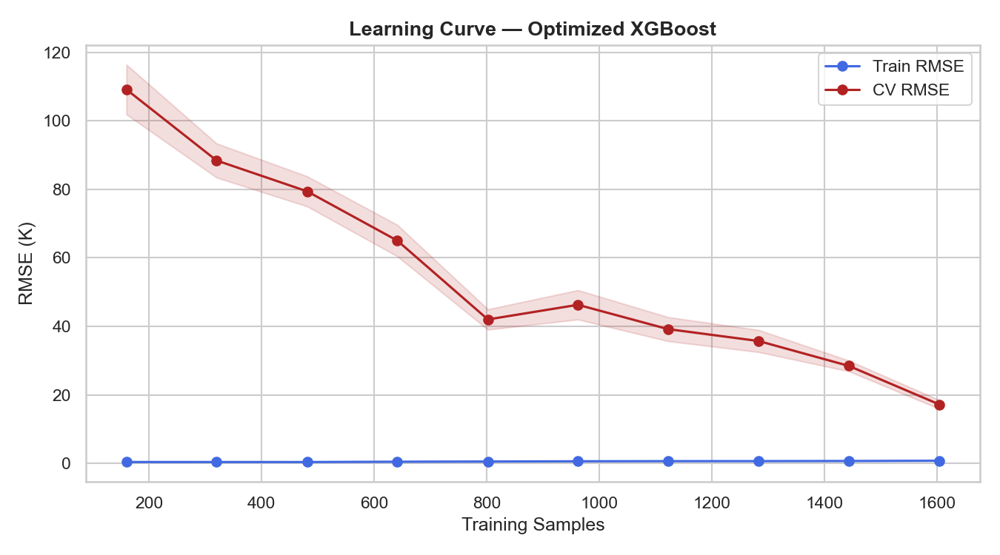
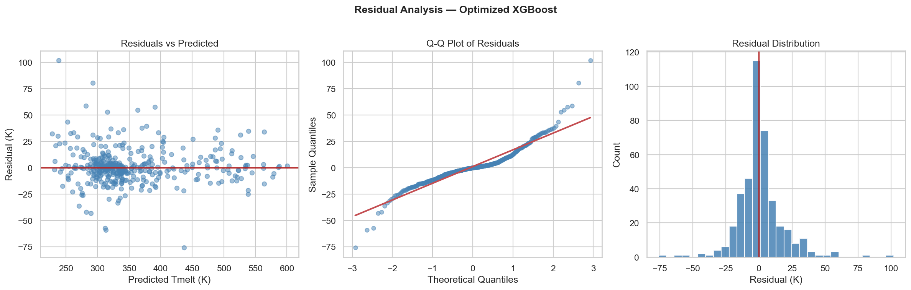
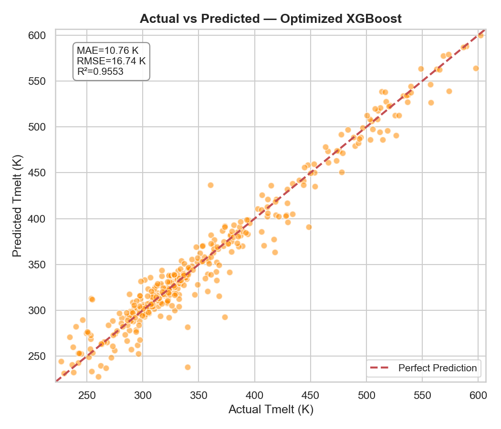
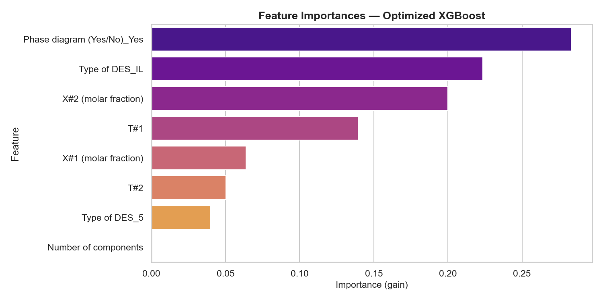

# Optimized Model Report

*Generated: 2026-06-17 10:33*

## 1. Baseline vs Optimized Metrics
| Metric | Baseline Train | Baseline Test | Baseline 5-Fold CV | Optimized Train | Optimized Test | Optimized 5-Fold CV |
|---|---|---|---|---|---|---|
| RMSE (K) | 3.141 | 17.533 | 18.642±1.359 | 0.759 | 16.739 | 17.384±1.222 |
| MAE (K)  | 2.053  | 11.228  | 11.537 | 0.513  | 10.763  | 10.879 |
| R²       | 0.9984 | 0.9510 | 0.9428±0.0106 | 0.9999 | 0.9553 | 0.9504±0.0086 |

> Improvement: Test RMSE Δ = +0.794 K | Test R² Δ = +0.0043 | CV RMSE Δ = +1.258 K

## 2. Optimized Hyperparameters
| Parameter | Baseline | Optimized |
|---|---|---|
| n_estimators | 200 | 800 |
| max_depth | 8 | 8 |
| learning_rate | 0.1 | 0.1 |
| subsample | — | 0.7 |
| colsample_bytree | — | 1.0 |
| min_child_weight | — | 1 |
| gamma | — | 0 |
| reg_alpha | — | 1 |
| reg_lambda | — | 5 |

> Overfitting gap (Train R² − Test R²): Baseline = 0.0474 → Optimized = 0.0446

## 3. Learning Curve Analysis

## 4. Residual Analysis

## 5. Actual vs Predicted

## 6. Feature Importance (Top 10)
| Rank | Feature | Importance |
|---|---|---|
| 1 | `Phase diagram (Yes/No)_Yes` | 0.28311 |
| 2 | `Type of DES_IL` | 0.22341 |
| 3 | `X#2 (molar fraction)` | 0.19991 |
| 4 | `T#1` | 0.13935 |
| 5 | `X#1 (molar fraction)` | 0.06397 |
| 6 | `T#2` | 0.05025 |
| 7 | `Type of DES_5` | 0.04001 |
| 8 | `Number of components` | 0.00000 |

## 7. Advanced Improvement Analysis
### Descriptor Utilization
The current model does **not** use molecular structure information.

| Enhancement | Estimated Improvement | Status |
|---|---|---|
| RDKit descriptors (14 features, already computed) | Moderate (~5–15% RMSE reduction) | Recommended |
| Morgan fingerprints (ECFP4, 1024-bit) | Moderate | Requires RDKit |
| ChemBERTa embeddings | High (if data volume sufficient) | Requires GPU/transformer |
| Feature engineering (T_ratio, ΔT_melt) | Low–moderate | Can be implemented |
| Ensemble (XGBoost + RF) | Low | Marginal for well-tuned single model |

> **Recommendation**: Adding the 14 pre-computed RDKit descriptors (from `DES_RDKit_Features.csv`) is the highest-value, lowest-effort enhancement. Morgan fingerprints would further improve coverage of structural diversity. Awaiting user approval before implementing.

## 8. Deployment Recommendation
- **Deploy**: `Models/xgboost_optimized.pkl` (trained on 100% of 2006 samples)
- **Expected CV RMSE**: 17.38 ± 1.22 K
- **Expected CV R²**: 0.9504 ± 0.0086
- **Confidence**: High for DES systems within training distribution; moderate for novel chemical classes
- **Monitoring**: Flag predictions where input features fall outside training range