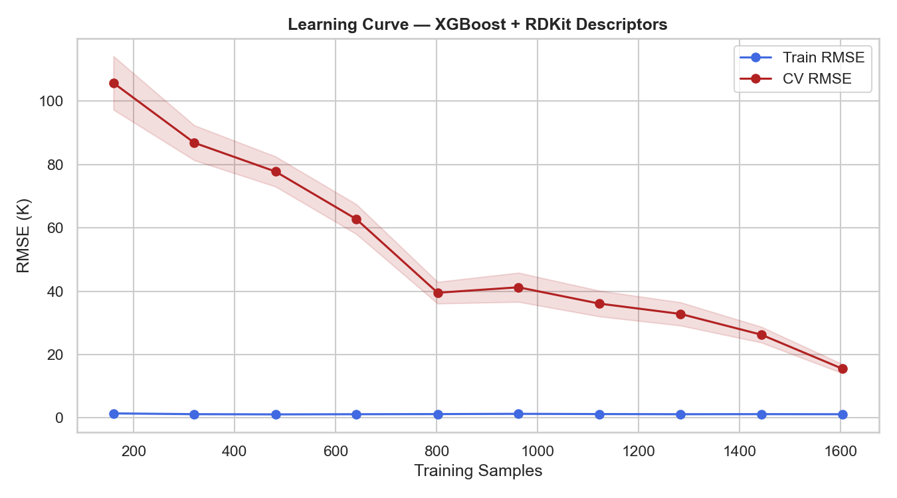
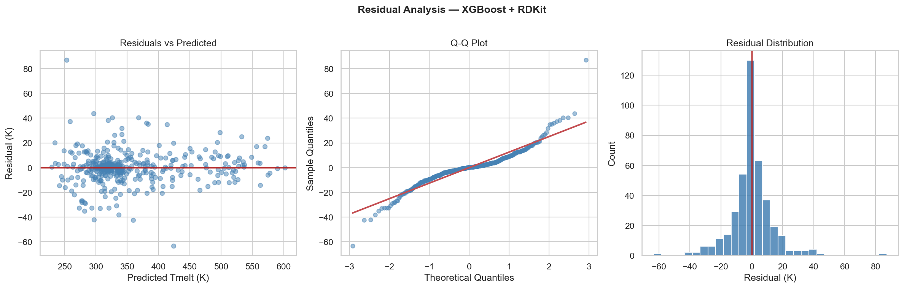
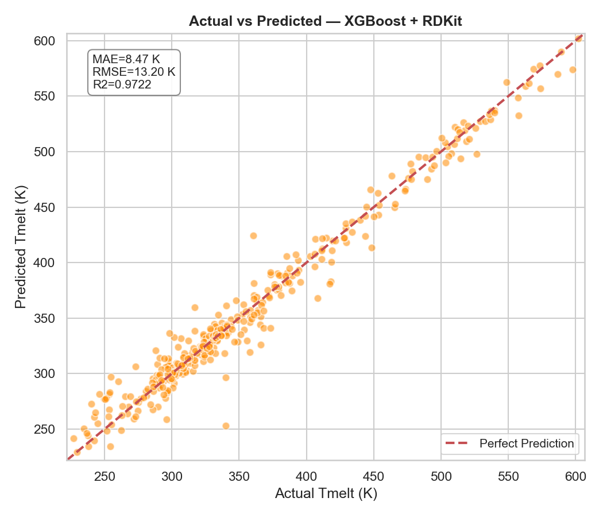
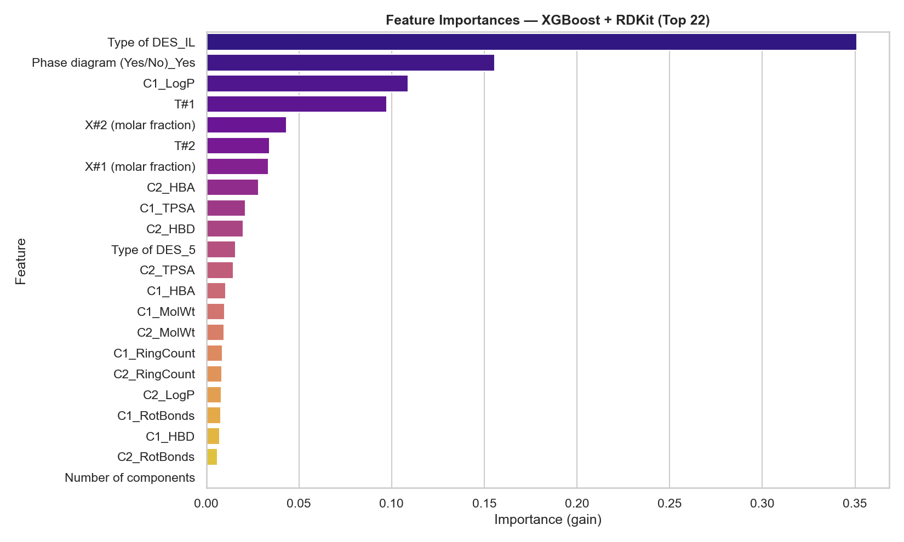
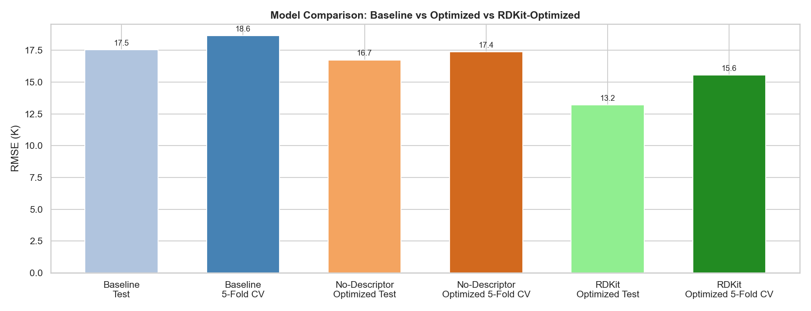

# RDKit Descriptor Model Report

*Generated: 2026-06-17 10:43*

## 1. Feature Set
Total numeric features: **19** (original 5 + 14 RDKit molecular descriptors)

| Category | Features |
|---|---|
| Original numeric | `Number of components`, `X#1 (molar fraction)`, `X#2 (molar fraction)`, `T#1`, `T#2` |
| RDKit – Component 1 | `C1_MolWt`, `C1_LogP`, `C1_TPSA`, `C1_HBD`, `C1_HBA`, `C1_RotBonds`, `C1_RingCount` |
| RDKit – Component 2 | `C2_MolWt`, `C2_LogP`, `C2_TPSA`, `C2_HBD`, `C2_HBA`, `C2_RotBonds`, `C2_RingCount` |
| Categorical | `Type of DES`, `Phase diagram (Yes/No)` |

## 2. Performance Comparison
| Model | Test RMSE (K) | Test R2 | CV RMSE (K) | CV R2 |
|---|---|---|---|---|
| Baseline XGBoost | 17.533 | 0.9510 | 18.642 | 0.9428 |
| Optimized (no descriptors) | 16.739 | 0.9553 | 17.384 | 0.9504 |
| **RDKit Optimized** | **13.196** | **0.9722** | **15.553** | **0.9601** |

> Improvement over descriptor-free optimized: Test RMSE +3.543 K | CV RMSE +1.831 K

## 3. Optimized Hyperparameters
| Parameter | Value |
|---|---|
| `subsample` | 0.6 |
| `reg_lambda` | 1 |
| `reg_alpha` | 0.1 |
| `n_estimators` | 800 |
| `min_child_weight` | 5 |
| `max_depth` | 10 |
| `learning_rate` | 0.05 |
| `gamma` | 0 |
| `colsample_bytree` | 0.9 |

> Overfitting gap (Train R2=0.9998 vs Test R2=0.9722): 0.0275

## 4. Learning Curve

## 5. Residual Analysis

## 6. Actual vs Predicted

## 7. Feature Importance (Top 15)
| Rank | Feature | Importance |
|---|---|---|
| 1 | `Type of DES_IL` | 0.35093 |
| 2 | `Phase diagram (Yes/No)_Yes` | 0.15566 |
| 3 | `C1_LogP` | 0.10891 |
| 4 | `T#1` | 0.09751 |
| 5 | `X#2 (molar fraction)` | 0.04321 |
| 6 | `T#2` | 0.03414 |
| 7 | `X#1 (molar fraction)` | 0.03359 |
| 8 | `C2_HBA` | 0.02832 |
| 9 | `C1_TPSA` | 0.02121 |
| 10 | `C2_HBD` | 0.01995 |
| 11 | `Type of DES_5` | 0.01591 |
| 12 | `C2_TPSA` | 0.01449 |
| 13 | `C1_HBA` | 0.01042 |
| 14 | `C1_MolWt` | 0.00995 |
| 15 | `C2_MolWt` | 0.00955 |

## 8. Model Comparison Chart

## 9. Deployment
- Saved: `Models/xgboost_rdkit_optimized.pkl`
- CV RMSE: 15.55 +/- 1.52 K
- CV R2:   0.9601 +/- 0.0091